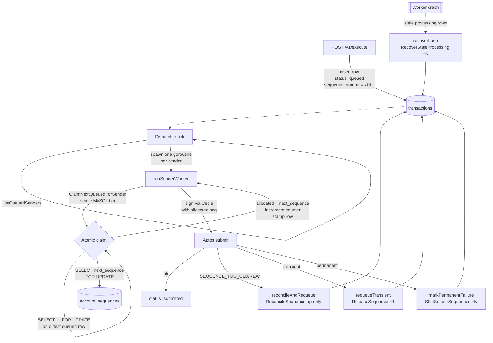
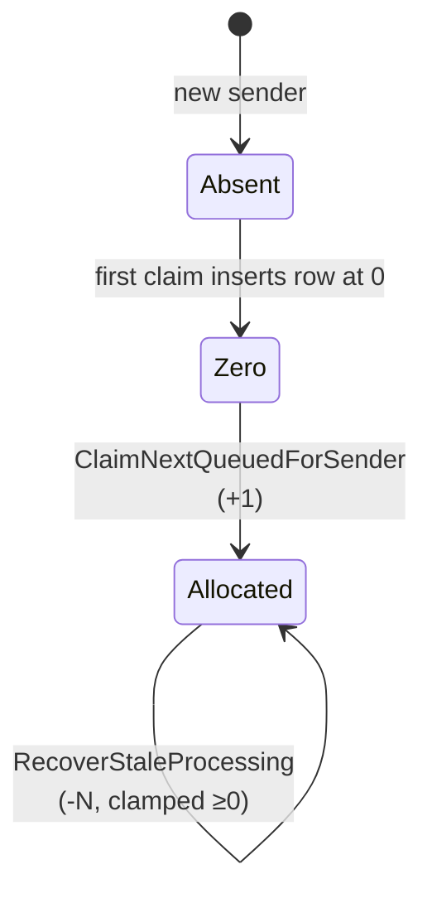
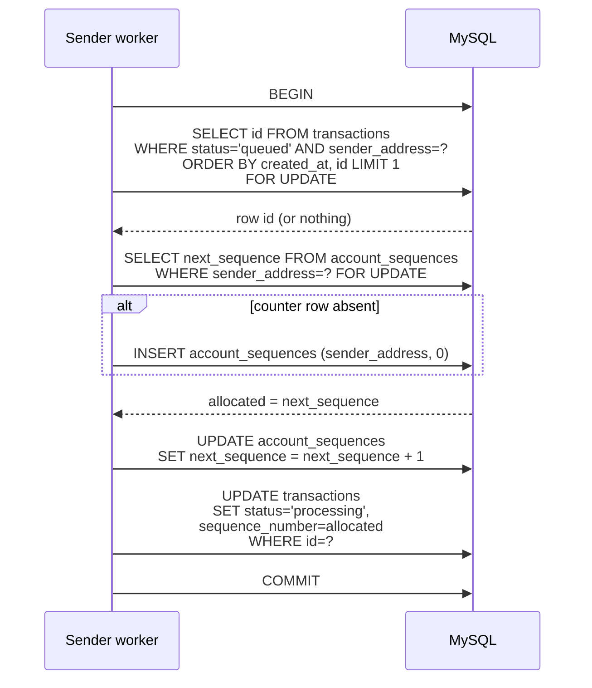

# Sequence Number Management

How the wallet service allocates, advances, and reconciles Aptos sequence numbers to guarantee FIFO submission per sender with no gaps and no duplicates.

---

## Why sequence numbers matter

Every Aptos transaction includes a `sequence_number` that must equal the sender account's next expected sequence on chain. The chain enforces exact ordering:

- `sequence_number < chain's expected` → rejected as `SEQUENCE_NUMBER_TOO_OLD` (duplicate)
- `sequence_number > chain's expected` → rejected as `SEQUENCE_NUMBER_TOO_NEW` (gap)
- `sequence_number == chain's expected` → accepted, chain advances by 1

This service accepts requests asynchronously via `/v1/execute` but must eventually submit each sender's transactions to chain in a contiguous, monotonically increasing sequence. The counter state lives in MySQL so multiple server instances can safely share the workload.

---

## Storage schema

Two tables, defined in [`internal/db/migrations/000001_init.up.sql`](internal/db/migrations/000001_init.up.sql):

```sql
account_sequences (
  sender_address  VARCHAR(128) PRIMARY KEY,
  next_sequence   BIGINT UNSIGNED NOT NULL DEFAULT 0,
  updated_at      TIMESTAMP
)

transactions (
  id               CHAR(36) PRIMARY KEY,
  sender_address   VARCHAR(128) NOT NULL,
  status           VARCHAR(32)  NOT NULL,  -- queued|processing|submitted|confirmed|failed|expired
  sequence_number  BIGINT UNSIGNED NULL,   -- NULL while queued, set at claim time
  …
)
```

**Core invariant** (documented on [`ClaimNextQueuedForSender`](internal/store/mysql/queue.go#L64)):

> Every row in `status=processing` or `status=submitted` has a `sequence_number` equal to the value of `account_sequences.next_sequence` at the moment it was claimed.

---

## High-level flow



---

## Counter lifecycle



All decrements are bounded at zero via `GREATEST(next_sequence - N, 0)`. `ReconcileSequence` is the only operation that raises the counter based on external (on-chain) state, and it only raises — never lowers.

---

## Where the counter is mutated

All counter mutations live in a single file: [`internal/store/mysql/queue.go`](internal/store/mysql/queue.go). This is deliberate — one file to audit for correctness of the invariant.

| Operation | Direction | Function | Called by |
|---|---|---|---|
| Allocate + stamp row | `+1` | [`ClaimNextQueuedForSender`](internal/store/mysql/queue.go#L64) | [`submitter.prepareRecord`](internal/submitter/submitter.go#L285) |
| Reconcile with chain | up-only (`GREATEST`) | [`ReconcileSequence`](internal/store/mysql/queue.go#L147) | [`submitter.reconcileAndRequeue`](internal/submitter/submitter.go#L519) |
| Release after signing failure | `−1` | [`ReleaseSequence`](internal/store/mysql/queue.go#L295) | [`submitter.requeueTransient`](internal/submitter/submitter.go#L467) |
| Shift after permanent failure | `−N` | [`ShiftSenderSequences`](internal/store/mysql/queue.go#L245) | [`submitter.markPermanentFailure`](internal/submitter/submitter.go#L444) |
| Crash recovery | `−N` | [`RecoverStaleProcessing`](internal/store/mysql/queue.go#L168) | [`submitter.recoverLoop`](internal/submitter/submitter.go#L149) |

Interface definition: [`store.Queue`](internal/store/store.go) in `internal/store/store.go`.

---

## The atomic claim (how it works)

`ClaimNextQueuedForSender` performs five operations inside a single MySQL transaction ([queue.go:64](internal/store/mysql/queue.go#L64)):



Row-level locking (`FOR UPDATE`) on both the transaction row and the counter row means a second server instance trying to claim for the same sender will block until the first commits — no double-allocation possible.

---

## Failure paths

Each failure path has a dedicated counter-maintenance function so the invariant holds even when submission fails.

### Transient signing/submit failure

Worker got a network error, Circle 5xx, or similar retryable failure.

- Row: `sequence_number` cleared, status flipped back to `queued`.
- Counter: `−1`.
- Why `−1` works: exactly one allocation got reversed. No other worker has advanced past this slot yet because the single-worker-per-sender invariant holds.

Call chain: [`submitSigned`](internal/submitter/submitter.go#L400) → [`requeueTransient`](internal/submitter/submitter.go#L467) → [`requeueRecord`](internal/submitter/submitter.go#L489) + [`ReleaseSequence`](internal/store/mysql/queue.go#L295).

### Sequence-mismatch failure

Aptos reported `SEQUENCE_NUMBER_TOO_OLD`, `TOO_NEW`, or `TOO_BIG`, either from `/transactions/simulate` (pre-submit) or from `SubmitTransaction`. Our counter has drifted from chain state.

- Row: requeued using `requeueWithoutRelease` (clears `sequence_number`, flips to `queued`, **does not** call `ReleaseSequence`).
- Siblings: every other `processing` row for the same sender is also `requeueWithoutRelease`d — they were signed with sequence numbers that are now invalid.
- Counter: raised (never lowered) to `GREATEST(next_sequence, chainSeq)`.
- Why up-only: a txn we just submitted may not be indexed on the node we queried; lowering would cause duplicate-sequence rejection on the next submit.
- Why not `ReleaseSequence`: reconcile just snapped the counter to chain truth. Decrementing for each requeued slot would push the counter back into the "too old" zone and loop forever at drift=1. See [`memory/sequence_counter_invariant.md`](../.claude/memory/sequence_counter_invariant.md) (or the inline comment on `applyReconcile`).

Call chain (submit path): `submitSigned` → `reconcileAndRequeue` → `applyReconcile` → `ReconcileSequence` + `requeueWithoutRelease`.

Call chain (simulate path): `prepareRecord` → (on `IsSequenceVmStatus` true) → `reconcileAndRequeue` → `applyReconcile`.

### Permanent failure

Max retries exhausted, or chain returned a non-retryable error (bad arguments, insufficient balance, expired, etc.).

- Failed row: marked `failed`.
- All *later* rows for this sender (sequence_number > failedSeqNum): reset to `queued` with `sequence_number=NULL`.
- Counter: `−N` where N = rows reset.
- Why shift: a permanent failure creates a gap at `failedSeqNum`. Every pipelined txn behind it was signed with a now-wrong sequence. They get re-signed on the next claim with correct, contiguous sequences.

Call chain: [`submitSigned`](internal/submitter/submitter.go#L400) → [`markPermanentFailure`](internal/submitter/submitter.go#L444) → [`ShiftSenderSequences`](internal/store/mysql/queue.go#L245).

### Worker crash

Worker died mid-submit, leaving rows stuck in `processing`.

- Rows older than a threshold: reset to `queued` with `sequence_number=NULL`.
- Counter: `−N` per sender, where N = number of rows reset.
- Why this is safe: the crashed worker either never submitted (counter decrement matches) or submitted successfully and the poller will eventually observe that and advance state via confirmation, not via the counter.

Call chain: [`recoverLoop`](internal/submitter/submitter.go#L149) → [`RecoverStaleProcessing`](internal/store/mysql/queue.go#L168).

---

## Why allocation happens at claim, not enqueue

If `/v1/execute` allocated a sequence synchronously:

1. A queued txn sitting for minutes would hold its sequence, blocking every newer submission behind it (chain gap).
2. Crashes between allocation and submit would leave permanent holes.
3. Multiple server instances would race on the counter at the HTTP layer.

Allocating inside the claim transaction — the same DB transaction that flips the row to `processing` — means:

- The counter only advances when a worker is about to sign and submit.
- The window for drift is bounded by how long one signing round-trip takes.
- The MySQL row lock on the counter is the *only* serialization point.

See [`internal/handler/execute.go`](internal/handler/execute.go) for the enqueue path (inserts with `sequence_number=NULL`).

---

## Read path — how the allocated sequence gets to chain

1. [`ClaimNextQueuedForSender`](internal/store/mysql/queue.go#L64) returns a [`TransactionRecord`](internal/store/store.go) with `SequenceNumber` set.
2. [`submitter.prepareRecord`](internal/submitter/submitter.go#L285) hands the record to the Aptos SDK to build a `RawTransaction` with `SequenceNumber = record.SequenceNumber`.
3. The `RawTransaction` is BCS-serialized and passed to Circle's `sign/transaction` endpoint via [`internal/circle/signer.go`](internal/circle/signer.go).
4. The returned signature + raw txn are submitted to the Aptos node. If the node accepts, the row is flipped to `status=submitted` with the returned `txn_hash`.
5. The [poller](internal/poller/poller.go) later observes finality and transitions the row to `confirmed` / `failed` / `expired`.

---

## Related docs

- [TRANSACTION_PIPELINE.md](TRANSACTION_PIPELINE.md) — end-to-end request lifecycle.
- Package doc: [`internal/submitter/doc.go`](internal/submitter/doc.go).
- Package doc: [`internal/store/mysql/doc.go`](internal/store/mysql/doc.go).
