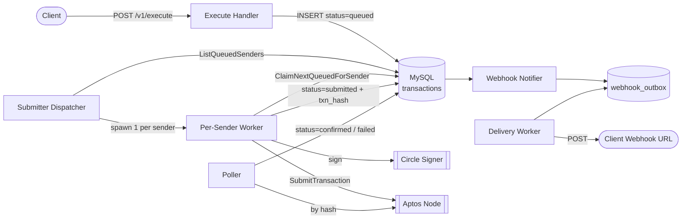
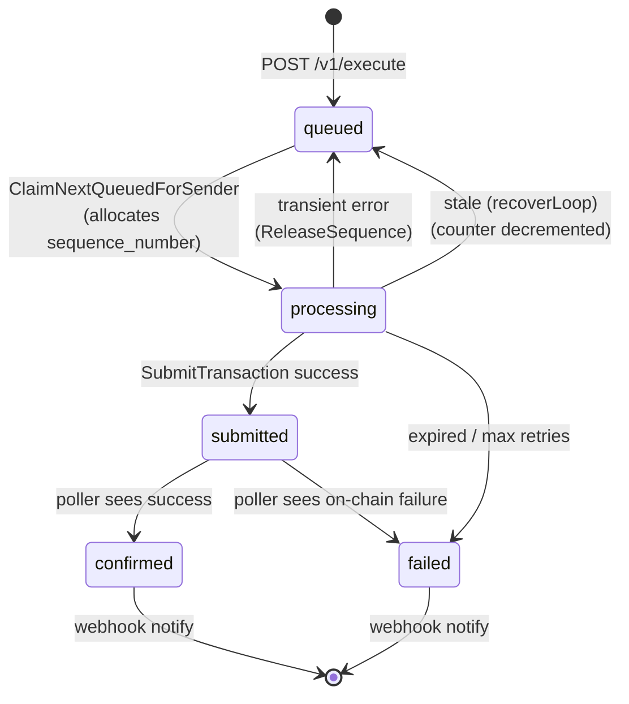
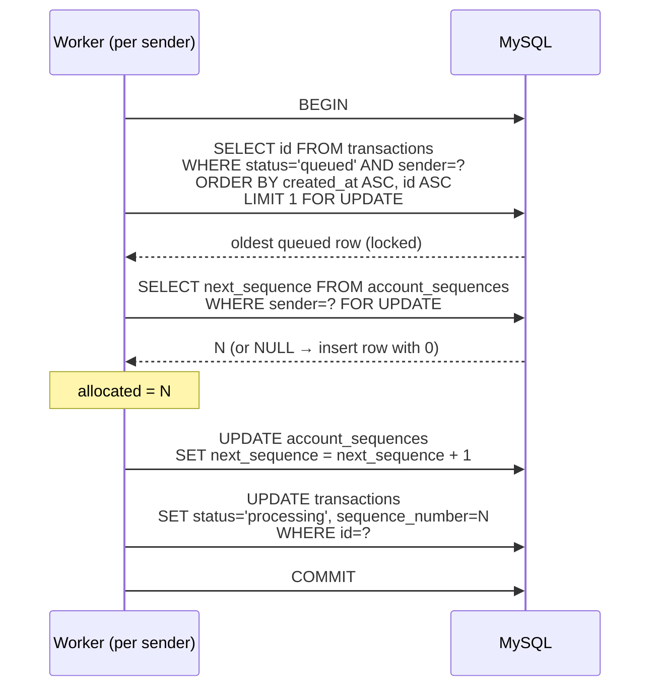
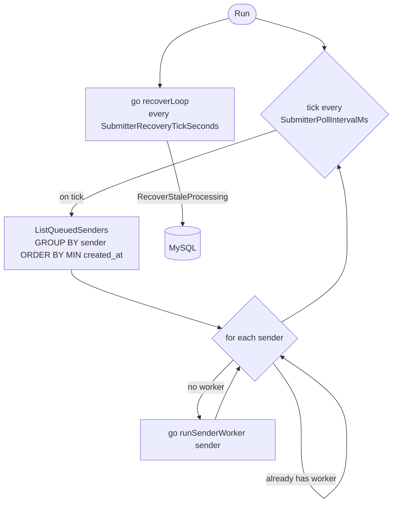
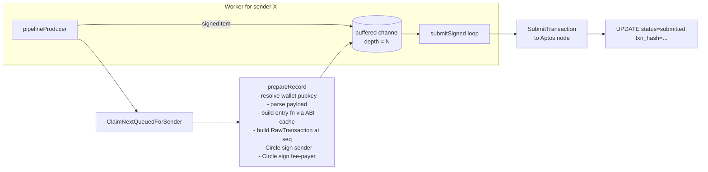
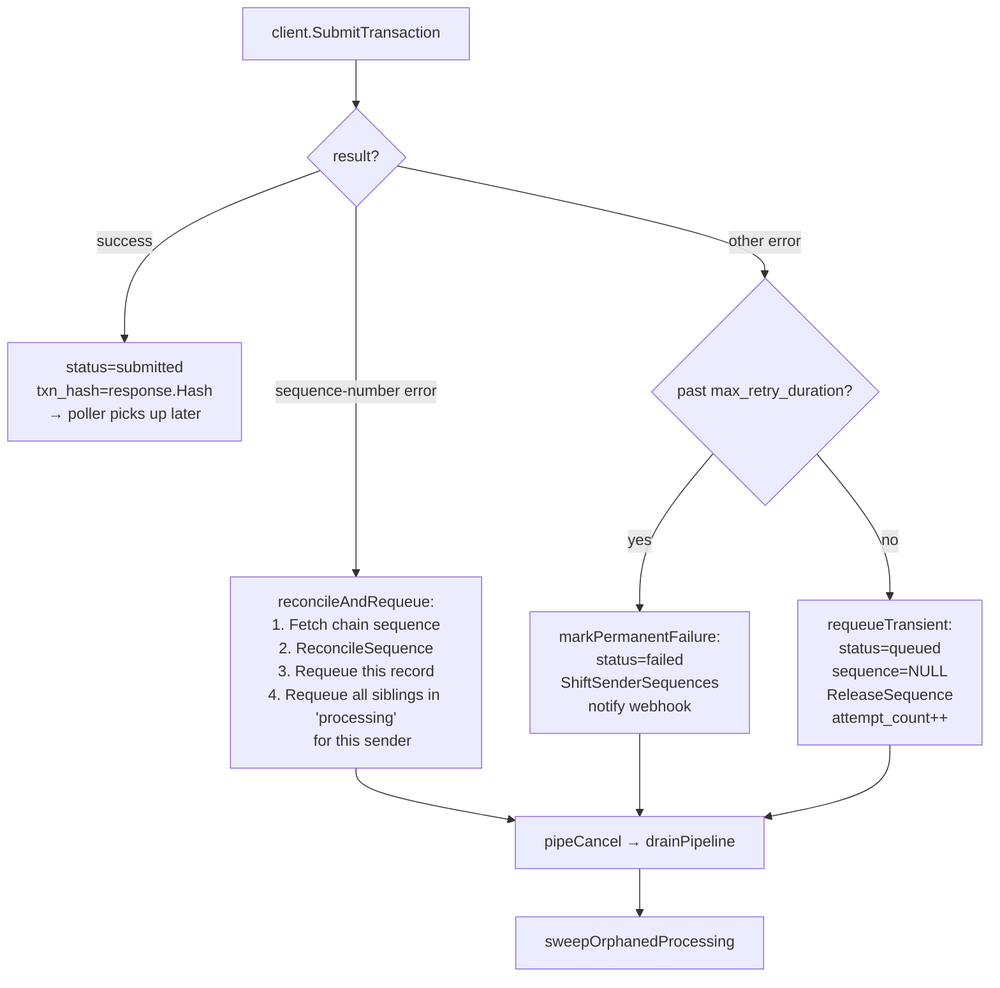
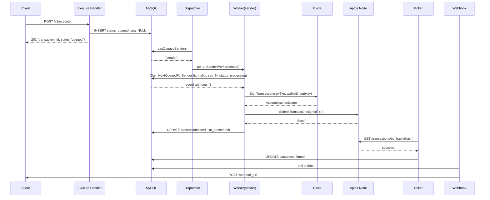

# Transaction Pipeline

How `POST /v1/execute` requests become on-chain Aptos transactions.

This document describes three things:

1. How transactions are **queued** and how per-sender FIFO order is preserved.
2. How **sequence numbers** are allocated and reconciled with the chain.
3. How the background **submitter** signs and submits transactions.

The pipeline is designed around one hard invariant:

> **One worker goroutine per sender address.** All per-sender ordering and sequence-number guarantees depend on this.

---

## High-level flow



---

## 1. Queuing

### Write path — `internal/handler/execute.go`

When `POST /v1/execute` arrives, the handler does exactly these things and nothing blockchain-related:

1. **Validate** the body: `wallet_id`, `address`, `function_id` format (`<addr>::<module>::<function>`), webhook URL SSRF check, optional `fee_payer`.
2. **Idempotency** — if `Idempotency-Key` (header or body) matches an existing row, replay that row's response with `X-Idempotency-Replayed: true`. No new row is created.
3. **Canonicalize** the sender address (long-form hex).
4. **Build and insert** a `TransactionRecord`:
   - `id` = fresh UUIDv4
   - `status` = `queued`
   - `created_at` = `time.Now().UTC()` (assigned in Go)
   - `expires_at` = `created_at + TxnExpirationSeconds`
   - `sequence_number` = **NULL** — *no sequence is assigned yet*
5. Return `202 Accepted` with `{transaction_id, status: "queued"}`.

No signing, no ABI lookup, no sequence-number allocation happens on the request path. The handler is intentionally cheap so that the HTTP response is fast and the submitter can catch up asynchronously.

### Schema — `internal/db/migrations/000001_init.up.sql`

```sql
CREATE TABLE transactions (
  id CHAR(36) PRIMARY KEY,
  sender_address VARCHAR(128) NOT NULL,
  wallet_id VARCHAR(128) NOT NULL,
  status VARCHAR(32) NOT NULL,
  sequence_number BIGINT UNSIGNED NULL,    -- allocated at claim time
  function_id TEXT NOT NULL,
  payload_json JSON NOT NULL,
  max_gas_amount BIGINT UNSIGNED NULL,
  idempotency_key VARCHAR(512) NULL,
  txn_hash VARCHAR(256) NULL,
  attempt_count INT NOT NULL DEFAULT 0,
  created_at TIMESTAMP NOT NULL,
  updated_at TIMESTAMP NOT NULL,
  expires_at TIMESTAMP NOT NULL,
  UNIQUE KEY uk_idempotency (idempotency_key),
  KEY idx_queue (status, sender_address, id),
  KEY idx_poller (status, txn_hash(128))
);

CREATE TABLE account_sequences (
  sender_address VARCHAR(128) PRIMARY KEY,
  next_sequence BIGINT UNSIGNED NOT NULL DEFAULT 0,
  updated_at TIMESTAMP NOT NULL
);
```

### Ordering guarantee — `internal/store/mysql/queue.go`

The submitter picks work with this query:

```sql
SELECT id FROM transactions
WHERE status = 'queued' AND sender_address = ?
ORDER BY created_at ASC, id ASC
LIMIT 1
FOR UPDATE
```

Two details matter:

- **`created_at` is the ordering key.** Since it's assigned by the API server (not MySQL), cross-instance ordering depends on clock skew. With a single API instance this is exact; with several behind a load balancer it relies on NTP sync.
- **`id` is the tiebreaker.** If two rows share a millisecond, the UUID provides a stable, deterministic order so the sequence-number assignment is reproducible.
- **`FOR UPDATE`** takes an InnoDB row lock so two workers can't double-claim the same record. The composite index `idx_queue (status, sender_address, id)` is the hot path.

FIFO is per-sender only. Cross-sender ordering is **not** preserved — senders have independent queues, which is correct because Aptos sequence numbers are per-account.

### State machine



---

## 2. Sequence-number allocation

Sequence numbers are **not** assigned at enqueue time. They're allocated inside `ClaimNextQueuedForSender` (`internal/store/mysql/queue.go:38`), atomically with the status flip to `processing`, in a single DB transaction.



**Invariant**: every row in `processing` or `submitted` state has a `sequence_number` equal to `account_sequences.next_sequence` at the moment it was claimed. Per-sender sequence numbers are monotonically increasing and gap-free *as long as* no submission fails — and when one does, the recovery paths below close the gap.

### Reconciling with the chain

The counter can drift from on-chain state in two directions. Each has a dedicated mechanism:

| Drift direction | Cause | Handler | SQL effect |
|---|---|---|---|
| **Chain is ahead** of us | Another client submitted outside this service, or we restarted after a crash | `reconcileAndRequeue` on a sequence-number error from Aptos | `next_sequence = GREATEST(next_sequence, chainSeq)` |
| **Counter is ahead** of chain (allocated but not submitted) | Transient signing/network failure; worker crash | `ReleaseSequence` / `ShiftSenderSequences` / `RecoverStaleProcessing` | `next_sequence = GREATEST(next_sequence - N, 0)` |

`GREATEST(next_sequence, chainSeq)` is **deliberately one-directional up** — we never lower the counter based on chain state, because transactions we just submitted may not yet be indexed on the node we're querying, and lowering would cause a duplicate-sequence conflict on the next submit.

### Counter bookkeeping cheat-sheet

| Function | When called | Effect on `next_sequence` |
|---|---|---|
| `ClaimNextQueuedForSender` | Worker claims a queued row | `+1` |
| `ReleaseSequence` | Transient failure on a claimed row (`requeueTransient`, `requeueRecord`) | `-1` |
| `ShiftSenderSequences` | Permanent failure; higher-seq siblings need to slide down | `-N` (number of siblings requeued) |
| `RecoverStaleProcessing` | Recovery loop finds stuck `processing` rows | `-N` per sender |
| `ReconcileSequence` | Submit returned a sequence-number error | `= max(current, chainSeq)` |

---

## 3. Submission

The submitter lives in `internal/submitter/submitter.go` and has three layers.

### Layer 1 — Dispatcher (`Submitter.Run`)



- One global dispatcher goroutine ticks periodically.
- `ListQueuedSenders` returns distinct senders that currently have queued work, oldest-waiting-sender first.
- A `workers map[string]context.CancelFunc` guarantees **at most one worker goroutine per sender address** — this is the concurrency boundary that makes per-sender FIFO + sequence-number allocation safe.
- A separate `recoverLoop` resets rows stuck in `processing` back to `queued` and decrements the counter accordingly. This catches worker crashes.

### Layer 2 — Per-sender pipeline (`runSenderWorker`)

Each worker runs a producer/consumer pipeline connected by a buffered channel of depth `SubmitterSigningPipelineDepth`:



**Why a pipeline?** Circle signing is the latency bottleneck. While transaction *N* is being submitted to Aptos, transaction *N+1* is already being signed. This overlaps the two slow operations and roughly halves per-transaction latency. The buffered channel provides natural back-pressure: if submits stall, the producer blocks and stops burning Circle signing calls.

### Layer 3 — Submit outcomes (`submitSigned`)



#### Why cancel the whole pipeline on any failure?

Because the in-flight signed transactions after the failing one were built with sequence numbers that may now be invalid (sequence mismatch) or leave a permanent gap (permanent failure). `drainPipeline` reads the remaining signed items out of the channel and calls `requeueRecord` on each; `sweepOrphanedProcessing` catches the edge case where the producer committed a claim after `pipeCancel` but before it noticed the cancellation.

#### Sequence-error detection

`isSequenceError` matches error strings against `sequence_number`, `sequence number`, or `invalid_sequence`. This is fragile — if Aptos changes the wording, real sequence mismatches will fall through to the generic retry branch and keep failing until `max_retry_duration` expires. A structured error code from the SDK would be more robust.

---

## End-to-end happy path



---

## Failure recovery paths

| Scenario | Detection | Recovery |
|---|---|---|
| API server process dies between HTTP accept and insert | n/a (request is lost) | Client retries with same `Idempotency-Key` |
| Worker crashes with a row in `processing` | `recoverLoop` → `RecoverStaleProcessing` after `SubmitterStaleProcessingSeconds` | Row returned to `queued` with `sequence_number=NULL`; counter decremented by N |
| Circle signing fails transiently | error in `prepareRecord` | `requeueTransient` → `queued`, `ReleaseSequence` (-1), `attempt_count++` |
| Aptos submit fails with sequence mismatch | `isSequenceError` true | Fetch chain seq → `ReconcileSequence` (up only) → requeue this + siblings |
| Aptos submit fails, past `MaxRetryDurationSeconds` | Age check in `submitSigned` | `markPermanentFailure` → `failed`, `ShiftSenderSequences` to slide down higher siblings, notify webhook |
| Transaction expires before claim | `now > ExpiresAt` check in `prepareRecord` | `markPermanentFailure` |
| Producer claims after pipeline cancelled | `sweepOrphanedProcessing` on worker exit | Requeue |

---

## Configuration knobs

All in `internal/config`; most are documented in `config.yaml`.

| Setting | Role |
|---|---|
| `SubmitterPollIntervalMs` | Dispatcher tick rate |
| `SubmitterSigningPipelineDepth` | Buffered channel depth — controls how far ahead the producer signs |
| `SubmitterMaxRetryDurationSeconds` | Wall-clock cap from `created_at`; exceeded → permanent failure |
| `SubmitterRetryIntervalSeconds` + `SubmitterRetryJitterSeconds` | Backoff after transient producer errors |
| `SubmitterRecoveryTickSeconds` | How often `recoverLoop` runs |
| `SubmitterStaleProcessingSeconds` | How long a row can sit in `processing` before recovery reclaims it |
| `TxnExpirationSeconds` | `expires_at = created_at + this`; enforced pre-sign |

---

## Why this design

- **Per-sender single-worker** — the cheap concurrency boundary that makes FIFO + per-account sequence numbers trivially correct. No distributed locks needed.
- **Sequence allocation at claim time, not enqueue time** — decouples HTTP latency from chain state. The order clients hit `/v1/execute` is the order transactions get sequence numbers, regardless of how flaky Circle or Aptos are.
- **Counter in MySQL rather than memory** — survives process restarts. The `FOR UPDATE` serialization is fine because there's only ever one worker per sender contending for any given counter row.
- **Pipeline with back-pressure** — overlaps the two slow operations (Circle sign, Aptos submit) without unbounded concurrency.
- **Outbox for webhooks** — terminal state changes insert into an outbox table that a separate worker drains. Webhook delivery latency never blocks the pipeline.
