# JC Contract Integration — API Design Document

> **Repository:** `aptos-labs/jc-contract-integration`
> **Language / Framework:** Go (Gin / Echo) + Aptos Go SDK
> **Last Updated:** 2026-02-27

---

## Table of Contents

1. [Executive Summary](#1-executive-summary)
2. [High-Level Architecture](#2-high-level-architecture)
3. [System Context Diagram](#3-system-context-diagram)
4. [Component Architecture](#4-component-architecture)
5. [API Endpoint Design](#5-api-endpoint-design)
6. [Data Models & Schemas](#6-data-models--schemas)
7. [Request / Response Lifecycle](#7-request--response-lifecycle)
8. [Authentication & Authorization](#8-authentication--authorization)
9. [Error Handling Strategy](#9-error-handling-strategy)
10. [Database Design](#10-database-design)
11. [Sequence Diagrams](#11-sequence-diagrams)
12. [Design Decisions & Tradeoffs](#12-design-decisions--tradeoffs)
13. [Future Expansions](#13-future-expansions)
14. [Future Testing & Integration Plans](#14-future-testing--integration-plans)
15. [Appendix](#15-appendix)

---

## 1. Executive Summary

The **JC Contract Integration** service is a Go-based HTTP API that acts as a middleware layer between client applications and the Aptos blockchain. It abstracts the complexity of direct blockchain interaction — transaction construction, BCS serialization, gas estimation, sequence-number management, and event indexing — behind a clean, versioned REST API.

### Goals

| Goal | Description |
|------|-------------|
| **Abstraction** | Hide Move/BCS complexity from API consumers |
| **Reliability** | Guarantee transaction delivery with retries and idempotency |
| **Observability** | Full request tracing, metrics, and structured logging |
| **Security** | Key management via HSM/vault; scoped API-key access |
| **Scalability** | Stateless compute with horizontal scaling behind a load balancer |

---

## 2. High-Level Architecture

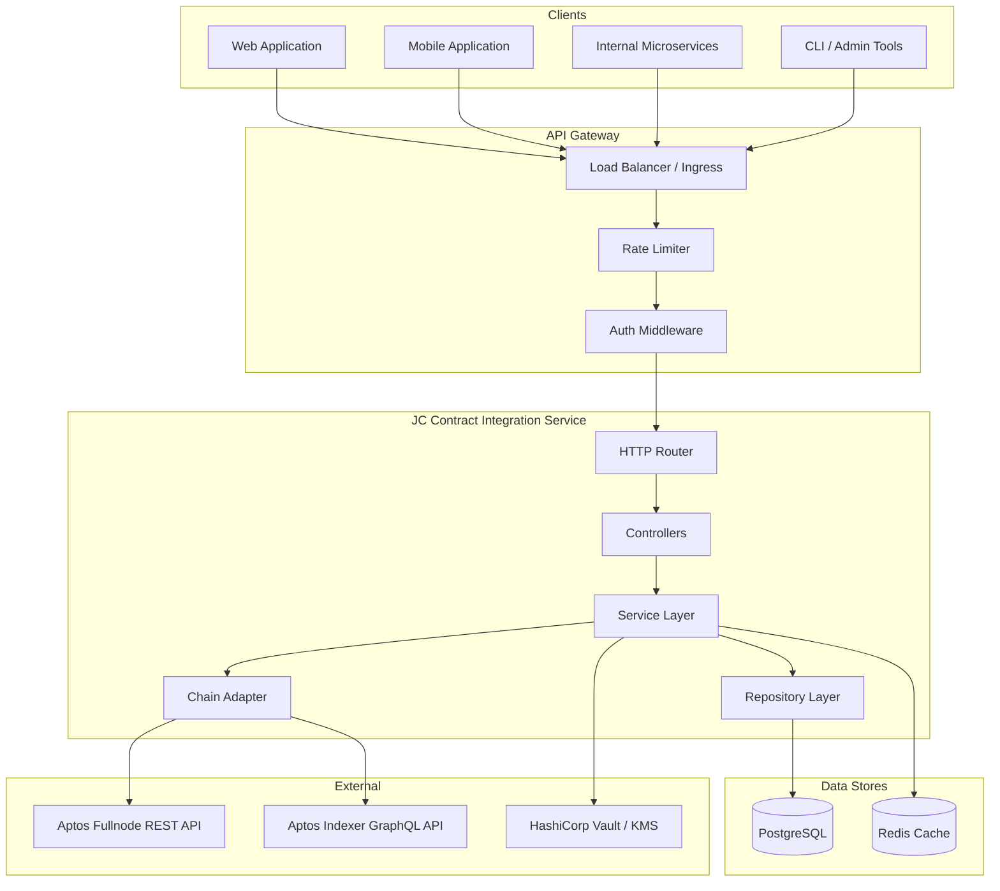
```mermaid
graph TB
    subgraph Clients
        WEB[Web Application]
        MOB[Mobile Application]
        SVC[Internal Microservices]
        CLI[CLI / Admin Tools]
    end

    subgraph API Gateway
        LB[Load Balancer / Ingress]
        RL[Rate Limiter]
        AUTH[Auth Middleware]
    end

    subgraph JC Contract Integration Service
        ROUTER[HTTP Router]
        CTRL[Controllers]
        SRV[Service Layer]
        REPO[Repository Layer]
        CHAIN[Chain Adapter]
    end

    subgraph Data Stores
        PG[(PostgreSQL)]
        REDIS[(Redis Cache)]
    end

    subgraph External
        APTOS_FN[Aptos Fullnode REST API]
        APTOS_IDX[Aptos Indexer GraphQL API]
        VAULT[HashiCorp Vault / KMS]
    end

    WEB --> LB
    MOB --> LB
    SVC --> LB
    CLI --> LB
    LB --> RL --> AUTH --> ROUTER
    ROUTER --> CTRL --> SRV
    SRV --> REPO --> PG
    SRV --> REDIS
    SRV --> CHAIN
    CHAIN --> APTOS_FN
    CHAIN --> APTOS_IDX
    SRV --> VAULT
```

### Layer Responsibilities

| Layer | Responsibility |
|-------|---------------|
| **HTTP Router** | Route matching, versioning (`/v1/...`), request parsing |
| **Controllers** | Input validation, request ↔ response mapping |
| **Service Layer** | Business logic, transaction orchestration, caching strategy |
| **Repository Layer** | Database CRUD, query building, migrations |
| **Chain Adapter** | Aptos Go SDK wrapper — transaction build, sign, submit, wait |

---

## 3. System Context Diagram

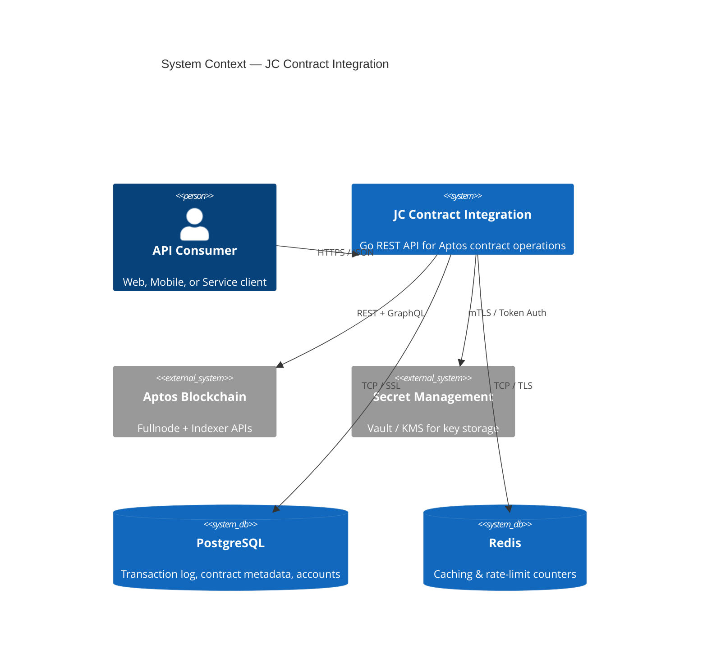
```mermaid
C4Context
    title System Context — JC Contract Integration

    Person(user, "API Consumer", "Web, Mobile, or Service client")
    System(jc, "JC Contract Integration", "Go REST API for Aptos contract operations")
    System_Ext(aptos, "Aptos Blockchain", "Fullnode + Indexer APIs")
    System_Ext(vault, "Secret Management", "Vault / KMS for key storage")
    SystemDb(pg, "PostgreSQL", "Transaction log, contract metadata, accounts")
    SystemDb(redis, "Redis", "Caching & rate-limit counters")

    Rel(user, jc, "HTTPS / JSON")
    Rel(jc, aptos, "REST + GraphQL")
    Rel(jc, vault, "mTLS / Token Auth")
    Rel(jc, pg, "TCP / SSL")
    Rel(jc, redis, "TCP / TLS")
```

---

## 4. Component Architecture

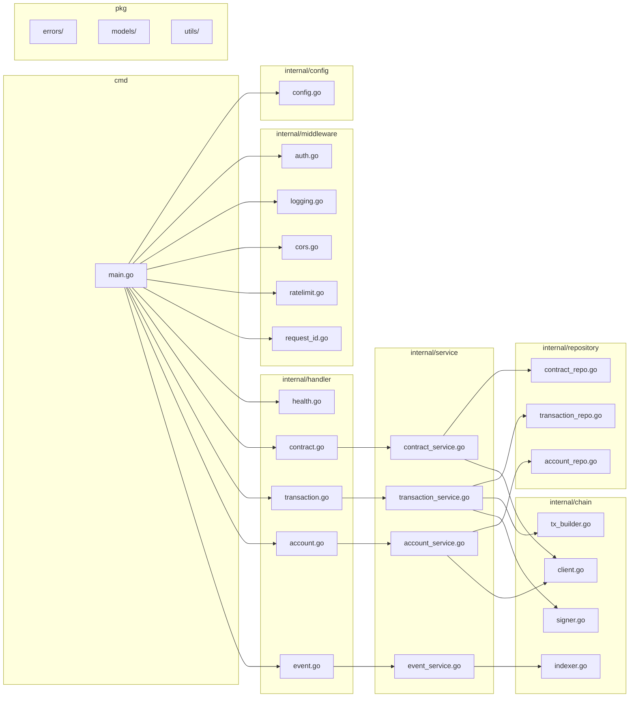
```mermaid
graph LR
    subgraph cmd
        MAIN[main.go]
    end

    subgraph internal/config
        CFG[config.go]
    end

    subgraph internal/middleware
        MW_AUTH[auth.go]
        MW_LOG[logging.go]
        MW_CORS[cors.go]
        MW_RATE[ratelimit.go]
        MW_REQ[request_id.go]
    end

    subgraph internal/handler
        H_HEALTH[health.go]
        H_CONTRACT[contract.go]
        H_TX[transaction.go]
        H_ACCOUNT[account.go]
        H_EVENT[event.go]
    end

    subgraph internal/service
        S_CONTRACT[contract_service.go]
        S_TX[transaction_service.go]
        S_ACCOUNT[account_service.go]
        S_EVENT[event_service.go]
    end

    subgraph internal/repository
        R_TX[transaction_repo.go]
        R_CONTRACT[contract_repo.go]
        R_ACCOUNT[account_repo.go]
    end

    subgraph internal/chain
        C_CLIENT[client.go]
        C_TX_BUILDER[tx_builder.go]
        C_SIGNER[signer.go]
        C_INDEXER[indexer.go]
    end

    subgraph pkg
        P_ERRORS[errors/]
        P_MODELS[models/]
        P_UTILS[utils/]
    end

    MAIN --> CFG
    MAIN --> MW_AUTH & MW_LOG & MW_CORS & MW_RATE & MW_REQ
    MAIN --> H_HEALTH & H_CONTRACT & H_TX & H_ACCOUNT & H_EVENT
    H_CONTRACT --> S_CONTRACT
    H_TX --> S_TX
    H_ACCOUNT --> S_ACCOUNT
    H_EVENT --> S_EVENT
    S_CONTRACT --> R_CONTRACT & C_CLIENT
    S_TX --> R_TX & C_TX_BUILDER & C_SIGNER
    S_ACCOUNT --> R_ACCOUNT & C_CLIENT
    S_EVENT --> C_INDEXER
```

### Directory Layout

```
jc-contract-integration/
├── cmd/
│   └── server/
│       └── main.go              # Entrypoint
├── internal/
│   ├── config/                  # Env-based configuration
│   ├── middleware/               # HTTP middleware stack
│   ├── handler/                 # HTTP handlers (controllers)
│   ├── service/                 # Business logic
│   ├── repository/              # Data access
│   └── chain/                   # Aptos blockchain adapter
├── pkg/
│   ├── models/                  # Shared domain models
│   ├── errors/                  # Custom error types
│   └── utils/                   # Helpers (pagination, validation)
├── migrations/                  # SQL migration files
├── docs/                        # This document & OpenAPI spec
├── scripts/                     # Dev tooling, seed data
├── .env.example
├── Dockerfile
├── docker-compose.yml
├── Makefile
├── go.mod
└── go.sum
```

---

## 5. API Endpoint Design

All endpoints are prefixed with `/api/v1`. Responses follow a consistent envelope.

### 5.1 Health & Meta

| Method | Path | Description |
|--------|------|-------------|
| `GET` | `/healthz` | Liveness probe |
| `GET` | `/readyz` | Readiness probe (DB + chain connectivity) |
| `GET` | `/api/v1/info` | Service version, chain ID, connected network |

### 5.2 Contracts

| Method | Path | Description |
|--------|------|-------------|
| `POST` | `/api/v1/contracts` | Register a contract (module address + name) |
| `GET` | `/api/v1/contracts` | List registered contracts (paginated) |
| `GET` | `/api/v1/contracts/:id` | Get contract details + ABI |
| `DELETE` | `/api/v1/contracts/:id` | Deregister a contract |
| `POST` | `/api/v1/contracts/:id/call` | Call a view function (read-only) |
| `POST` | `/api/v1/contracts/:id/execute` | Execute an entry function (state-changing) |
| `POST` | `/api/v1/contracts/:id/simulate` | Simulate a transaction before submission |

### 5.3 Transactions

| Method | Path | Description |
|--------|------|-------------|
| `GET` | `/api/v1/transactions` | List tracked transactions (paginated, filterable) |
| `GET` | `/api/v1/transactions/:hash` | Get transaction status & details |
| `POST` | `/api/v1/transactions/submit` | Submit a raw signed transaction |
| `POST` | `/api/v1/transactions/batch` | Submit a batch of transactions |

### 5.4 Accounts

| Method | Path | Description |
|--------|------|-------------|
| `POST` | `/api/v1/accounts` | Create / register a managed account |
| `GET` | `/api/v1/accounts/:address` | Get account info (sequence number, resources) |
| `GET` | `/api/v1/accounts/:address/resources` | List account resources |
| `GET` | `/api/v1/accounts/:address/modules` | List published modules |
| `GET` | `/api/v1/accounts/:address/balance` | Get APT balance |

### 5.5 Events

| Method | Path | Description |
|--------|------|-------------|
| `GET` | `/api/v1/events` | Query events (by contract, type, time range) |
| `POST` | `/api/v1/events/subscribe` | Create a webhook subscription for events |
| `DELETE` | `/api/v1/events/subscribe/:id` | Remove a webhook subscription |
| `GET` | `/api/v1/events/subscribe` | List active subscriptions |

### 5.6 Endpoint Flow Diagram

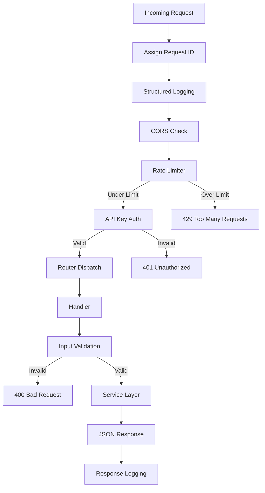
```mermaid
graph TD
    REQ[Incoming Request] --> RID[Assign Request ID]
    RID --> LOG[Structured Logging]
    LOG --> CORS[CORS Check]
    CORS --> RL[Rate Limiter]
    RL -->|Under Limit| AUTH[API Key Auth]
    RL -->|Over Limit| R429[429 Too Many Requests]
    AUTH -->|Valid| ROUTE[Router Dispatch]
    AUTH -->|Invalid| R401[401 Unauthorized]
    ROUTE --> HANDLER[Handler]
    HANDLER --> VALIDATE[Input Validation]
    VALIDATE -->|Invalid| R400[400 Bad Request]
    VALIDATE -->|Valid| SERVICE[Service Layer]
    SERVICE --> RESPONSE[JSON Response]
    RESPONSE --> LOG2[Response Logging]
```

---

## 6. Data Models & Schemas

### 6.1 Core Domain Models

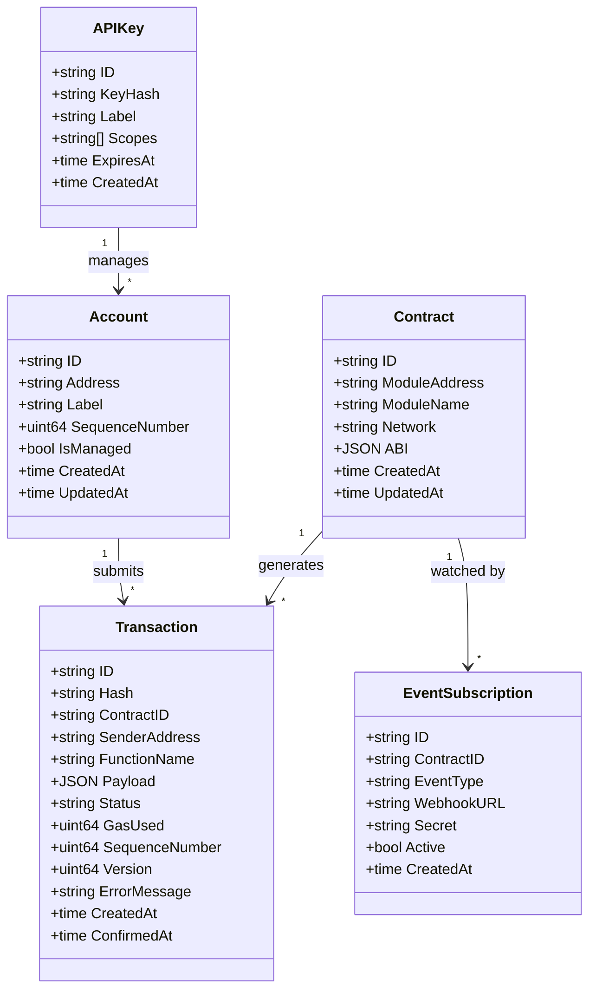
```mermaid
classDiagram
    class Contract {
        +string ID
        +string ModuleAddress
        +string ModuleName
        +string Network
        +JSON ABI
        +time CreatedAt
        +time UpdatedAt
    }

    class Transaction {
        +string ID
        +string Hash
        +string ContractID
        +string SenderAddress
        +string FunctionName
        +JSON Payload
        +string Status
        +uint64 GasUsed
        +uint64 SequenceNumber
        +uint64 Version
        +string ErrorMessage
        +time CreatedAt
        +time ConfirmedAt
    }

    class Account {
        +string ID
        +string Address
        +string Label
        +uint64 SequenceNumber
        +bool IsManaged
        +time CreatedAt
        +time UpdatedAt
    }

    class EventSubscription {
        +string ID
        +string ContractID
        +string EventType
        +string WebhookURL
        +string Secret
        +bool Active
        +time CreatedAt
    }

    class APIKey {
        +string ID
        +string KeyHash
        +string Label
        +string[] Scopes
        +time ExpiresAt
        +time CreatedAt
    }

    Contract "1" --> "*" Transaction : generates
    Account "1" --> "*" Transaction : submits
    Contract "1" --> "*" EventSubscription : watched by
    APIKey "1" --> "*" Account : manages
```

### 6.2 Response Envelope

All API responses follow this structure:

```json
{
  "success": true,
  "data": { ... },
  "meta": {
    "request_id": "req_abc123",
    "timestamp": "2026-02-27T12:00:00Z"
  },
  "pagination": {
    "page": 1,
    "per_page": 25,
    "total": 142,
    "total_pages": 6
  }
}
```

Error responses:

```json
{
  "success": false,
  "error": {
    "code": "INVALID_PAYLOAD",
    "message": "Field 'module_address' is required",
    "details": { ... }
  },
  "meta": {
    "request_id": "req_abc123",
    "timestamp": "2026-02-27T12:00:00Z"
  }
}
```

### 6.3 Key Request / Response Shapes

#### POST `/api/v1/contracts/:id/execute`

**Request:**
```json
{
  "function_name": "transfer",
  "type_arguments": ["0x1::aptos_coin::AptosCoin"],
  "arguments": ["0xrecipient...", "1000000"],
  "sender_address": "0xsender...",
  "max_gas_amount": 10000,
  "gas_unit_price": 100,
  "idempotency_key": "ik_unique_transfer_001"
}
```

**Response (202 Accepted):**
```json
{
  "success": true,
  "data": {
    "transaction_id": "txn_abc123",
    "hash": "0xabc...def",
    "status": "pending",
    "submitted_at": "2026-02-27T12:00:00Z"
  },
  "meta": {
    "request_id": "req_xyz789",
    "timestamp": "2026-02-27T12:00:00Z"
  }
}
```

#### POST `/api/v1/contracts/:id/call` (View Function)

**Request:**
```json
{
  "function_name": "get_balance",
  "type_arguments": ["0x1::aptos_coin::AptosCoin"],
  "arguments": ["0xaccount..."]
}
```

**Response (200 OK):**
```json
{
  "success": true,
  "data": {
    "result": ["50000000"]
  },
  "meta": {
    "request_id": "req_xyz790",
    "timestamp": "2026-02-27T12:00:00Z"
  }
}
```

---

## 7. Request / Response Lifecycle

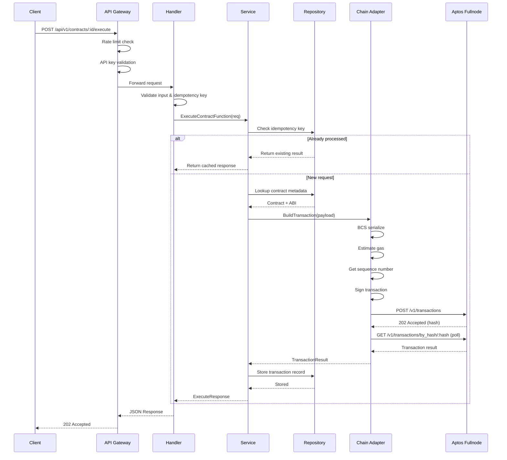
```mermaid
sequenceDiagram
    participant C as Client
    participant GW as API Gateway
    participant H as Handler
    participant S as Service
    participant R as Repository
    participant CH as Chain Adapter
    participant AP as Aptos Fullnode

    C->>GW: POST /api/v1/contracts/:id/execute
    GW->>GW: Rate limit check
    GW->>GW: API key validation
    GW->>H: Forward request

    H->>H: Validate input & idempotency key
    H->>S: ExecuteContractFunction(req)

    S->>R: Check idempotency key
    alt Already processed
        R-->>S: Return existing result
        S-->>H: Return cached response
    else New request
        S->>R: Lookup contract metadata
        R-->>S: Contract + ABI

        S->>CH: BuildTransaction(payload)
        CH->>CH: BCS serialize
        CH->>CH: Estimate gas
        CH->>CH: Get sequence number
        CH->>CH: Sign transaction

        CH->>AP: POST /v1/transactions
        AP-->>CH: 202 Accepted (hash)

        CH->>AP: GET /v1/transactions/by_hash/:hash (poll)
        AP-->>CH: Transaction result

        CH-->>S: TransactionResult

        S->>R: Store transaction record
        R-->>S: Stored

        S-->>H: ExecuteResponse
    end

    H-->>GW: JSON Response
    GW-->>C: 202 Accepted
```

---

## 8. Authentication & Authorization

### Auth Flow

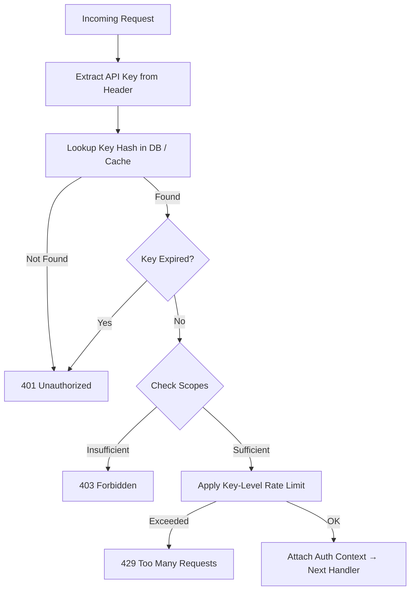
```mermaid
flowchart TD
    REQ[Incoming Request] --> EXTRACT[Extract API Key from Header]
    EXTRACT --> LOOKUP[Lookup Key Hash in DB / Cache]
    LOOKUP -->|Not Found| R401[401 Unauthorized]
    LOOKUP -->|Found| EXPIRY{Key Expired?}
    EXPIRY -->|Yes| R401
    EXPIRY -->|No| SCOPES{Check Scopes}
    SCOPES -->|Insufficient| R403[403 Forbidden]
    SCOPES -->|Sufficient| RATELIMIT[Apply Key-Level Rate Limit]
    RATELIMIT -->|Exceeded| R429[429 Too Many Requests]
    RATELIMIT -->|OK| PASS[Attach Auth Context → Next Handler]
```

### Scope Model

| Scope | Grants Access To |
|-------|-----------------|
| `contracts:read` | GET contract endpoints |
| `contracts:write` | POST/DELETE contract endpoints |
| `contracts:execute` | Execute and simulate transactions |
| `transactions:read` | GET transaction endpoints |
| `transactions:submit` | Submit raw transactions |
| `accounts:read` | GET account endpoints |
| `accounts:manage` | Create / manage accounts |
| `events:read` | GET event endpoints |
| `events:subscribe` | Manage webhook subscriptions |
| `admin` | Full access including key management |

### Key Management

- API keys are generated as 256-bit random tokens, prefixed with `jcint_`
- Only the **SHA-256 hash** of the key is stored in the database
- Keys support optional expiration dates
- Keys are scoped to specific permission sets
- Rotation: new key issued → old key enters grace period → old key revoked

---

## 9. Error Handling Strategy

### Error Code Taxonomy


```mermaid
graph TD
    ERR[Error] --> CLIENT[Client Errors 4xx]
    ERR --> SERVER[Server Errors 5xx]
    ERR --> CHAIN_ERR[Chain Errors]

    CLIENT --> C400[400 VALIDATION_ERROR]
    CLIENT --> C401[401 UNAUTHORIZED]
    CLIENT --> C403[403 FORBIDDEN]
    CLIENT --> C404[404 NOT_FOUND]
    CLIENT --> C409[409 CONFLICT / DUPLICATE]
    CLIENT --> C422[422 UNPROCESSABLE_ENTITY]
    CLIENT --> C429[429 RATE_LIMITED]

    SERVER --> S500[500 INTERNAL_ERROR]
    SERVER --> S502[502 UPSTREAM_ERROR]
    SERVER --> S503[503 SERVICE_UNAVAILABLE]

    CHAIN_ERR --> CE1[CHAIN_UNREACHABLE]
    CHAIN_ERR --> CE2[SEQUENCE_NUMBER_STALE]
    CHAIN_ERR --> CE3[INSUFFICIENT_GAS]
    CHAIN_ERR --> CE4[MOVE_ABORT]
    CHAIN_ERR --> CE5[TX_EXPIRED]
    CHAIN_ERR --> CE6[SIMULATION_FAILED]
```

### Error Response Contract

```json
{
  "success": false,
  "error": {
    "code": "MOVE_ABORT",
    "message": "Transaction aborted by Move module",
    "details": {
      "abort_code": 5,
      "module": "0x1::coin",
      "function": "transfer",
      "description": "Insufficient balance"
    }
  },
  "meta": {
    "request_id": "req_abc123",
    "timestamp": "2026-02-27T12:00:01Z"
  }
}
```

### Retry Policy (Chain Adapter)

| Error Category | Retryable | Strategy |
|---------------|-----------|----------|
| Network timeout | Yes | Exponential backoff (1s, 2s, 4s) — max 3 |
| 5xx from Aptos node | Yes | Exponential backoff — max 3 |
| Stale sequence number | Yes | Re-fetch sequence number, retry once |
| Move abort | No | Return error immediately |
| Invalid payload | No | Return 400 immediately |

---

## 10. Database Design

### Entity-Relationship Diagram

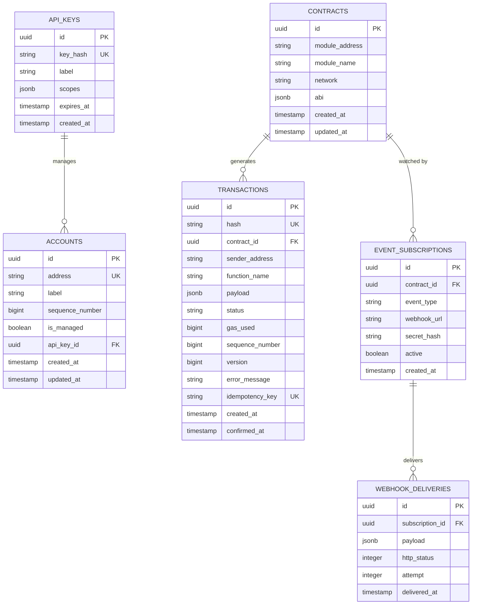
```mermaid
erDiagram
    API_KEYS {
        uuid id PK
        string key_hash UK
        string label
        jsonb scopes
        timestamp expires_at
        timestamp created_at
    }

    CONTRACTS {
        uuid id PK
        string module_address
        string module_name
        string network
        jsonb abi
        timestamp created_at
        timestamp updated_at
    }

    ACCOUNTS {
        uuid id PK
        string address UK
        string label
        bigint sequence_number
        boolean is_managed
        uuid api_key_id FK
        timestamp created_at
        timestamp updated_at
    }

    TRANSACTIONS {
        uuid id PK
        string hash UK
        uuid contract_id FK
        string sender_address
        string function_name
        jsonb payload
        string status
        bigint gas_used
        bigint sequence_number
        bigint version
        string error_message
        string idempotency_key UK
        timestamp created_at
        timestamp confirmed_at
    }

    EVENT_SUBSCRIPTIONS {
        uuid id PK
        uuid contract_id FK
        string event_type
        string webhook_url
        string secret_hash
        boolean active
        timestamp created_at
    }

    WEBHOOK_DELIVERIES {
        uuid id PK
        uuid subscription_id FK
        jsonb payload
        integer http_status
        integer attempt
        timestamp delivered_at
    }

    API_KEYS ||--o{ ACCOUNTS : "manages"
    CONTRACTS ||--o{ TRANSACTIONS : "generates"
    CONTRACTS ||--o{ EVENT_SUBSCRIPTIONS : "watched by"
    EVENT_SUBSCRIPTIONS ||--o{ WEBHOOK_DELIVERIES : "delivers"
```

### Indexes

| Table | Index | Purpose |
|-------|-------|---------|
| `transactions` | `idx_tx_hash` (UNIQUE) | Fast lookup by on-chain hash |
| `transactions` | `idx_tx_idempotency` (UNIQUE) | Idempotency deduplication |
| `transactions` | `idx_tx_contract_status` | Filter by contract + status |
| `transactions` | `idx_tx_sender_created` | Sender history, ordered |
| `contracts` | `idx_contract_addr_name` (UNIQUE) | Dedup registration |
| `accounts` | `idx_account_address` (UNIQUE) | Address lookup |
| `api_keys` | `idx_key_hash` (UNIQUE) | Auth lookup |

### Migration Strategy

- Migrations managed by [golang-migrate](https://github.com/golang-migrate/migrate)
- Numbered files: `000001_create_contracts.up.sql` / `000001_create_contracts.down.sql`
- Applied automatically on startup in dev; manually via CI in production

---

## 11. Sequence Diagrams

### 11.1 Contract Registration

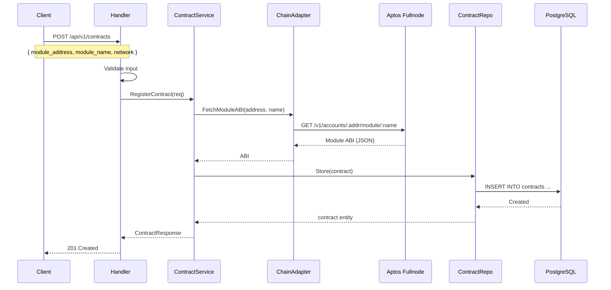
```mermaid
sequenceDiagram
    participant C as Client
    participant H as Handler
    participant S as ContractService
    participant CH as ChainAdapter
    participant AP as Aptos Fullnode
    participant R as ContractRepo
    participant DB as PostgreSQL

    C->>H: POST /api/v1/contracts
    Note over C,H: { module_address, module_name, network }
    H->>H: Validate input
    H->>S: RegisterContract(req)

    S->>CH: FetchModuleABI(address, name)
    CH->>AP: GET /v1/accounts/:addr/module/:name
    AP-->>CH: Module ABI (JSON)
    CH-->>S: ABI

    S->>R: Store(contract)
    R->>DB: INSERT INTO contracts ...
    DB-->>R: Created
    R-->>S: contract entity

    S-->>H: ContractResponse
    H-->>C: 201 Created
```

### 11.2 Transaction Execution (State-Changing)

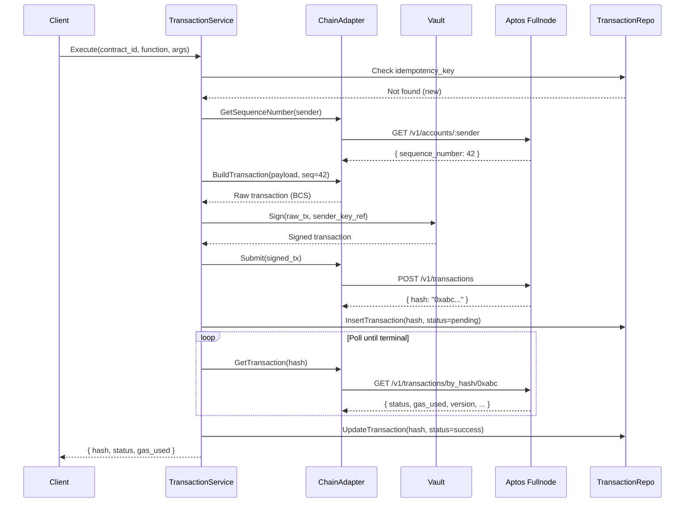
```mermaid
sequenceDiagram
    participant C as Client
    participant S as TransactionService
    participant CH as ChainAdapter
    participant V as Vault
    participant AP as Aptos Fullnode
    participant R as TransactionRepo

    C->>S: Execute(contract_id, function, args)

    S->>R: Check idempotency_key
    R-->>S: Not found (new)

    S->>CH: GetSequenceNumber(sender)
    CH->>AP: GET /v1/accounts/:sender
    AP-->>CH: { sequence_number: 42 }

    S->>CH: BuildTransaction(payload, seq=42)
    CH-->>S: Raw transaction (BCS)

    S->>V: Sign(raw_tx, sender_key_ref)
    V-->>S: Signed transaction

    S->>CH: Submit(signed_tx)
    CH->>AP: POST /v1/transactions
    AP-->>CH: { hash: "0xabc..." }

    S->>R: InsertTransaction(hash, status=pending)

    loop Poll until terminal
        S->>CH: GetTransaction(hash)
        CH->>AP: GET /v1/transactions/by_hash/0xabc
        AP-->>CH: { status, gas_used, version, ... }
    end

    S->>R: UpdateTransaction(hash, status=success)
    S-->>C: { hash, status, gas_used }
```

### 11.3 Event Webhook Delivery

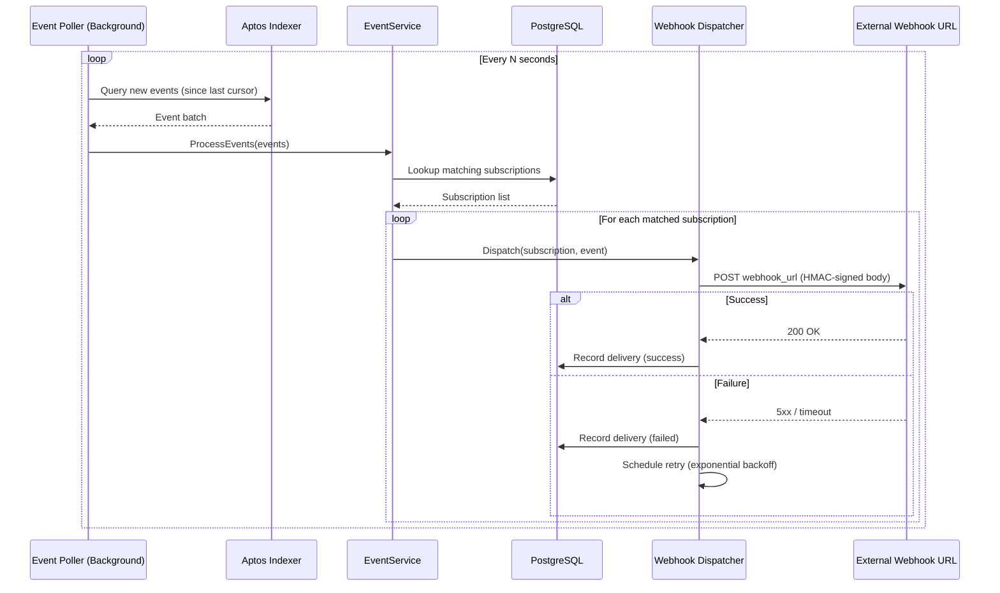
```mermaid
sequenceDiagram
    participant POLL as Event Poller (Background)
    participant IDX as Aptos Indexer
    participant S as EventService
    participant DB as PostgreSQL
    participant WH as Webhook Dispatcher
    participant EXT as External Webhook URL

    loop Every N seconds
        POLL->>IDX: Query new events (since last cursor)
        IDX-->>POLL: Event batch
        POLL->>S: ProcessEvents(events)

        S->>DB: Lookup matching subscriptions
        DB-->>S: Subscription list

        loop For each matched subscription
            S->>WH: Dispatch(subscription, event)
            WH->>EXT: POST webhook_url (HMAC-signed body)
            alt Success
                EXT-->>WH: 200 OK
                WH->>DB: Record delivery (success)
            else Failure
                EXT-->>WH: 5xx / timeout
                WH->>DB: Record delivery (failed)
                WH->>WH: Schedule retry (exponential backoff)
            end
        end
    end
```

---

## 12. Design Decisions & Tradeoffs

### Decision 1: Go as the Implementation Language

| Aspect | Detail |
|--------|--------|
| **Decision** | Use Go instead of TypeScript/Rust |
| **Rationale** | Strong concurrency model (goroutines) for parallel chain interactions; first-class Aptos Go SDK support; fast compile times; simple deployment as a single binary |
| **Tradeoff** | Smaller Move/Aptos ecosystem compared to TypeScript. The official TypeScript SDK receives updates first. Go SDK may lag behind on new features |
| **Mitigation** | Pin SDK version; contribute upstream patches when needed |

### Decision 2: Synchronous Transaction Submission with Polling

| Aspect | Detail |
|--------|--------|
| **Decision** | The `/execute` endpoint submits the transaction and polls for confirmation before returning (up to a timeout), returning `202 Accepted` immediately if confirmation takes too long |
| **Rationale** | Simpler client integration — callers get a terminal status in most cases without implementing their own polling |
| **Tradeoff** | Holds an HTTP connection open longer; under load this consumes server resources |
| **Mitigation** | Configurable poll timeout (default 10s); background worker finalizes status for timed-out requests; clients can opt for fire-and-forget mode via `?async=true` query param |

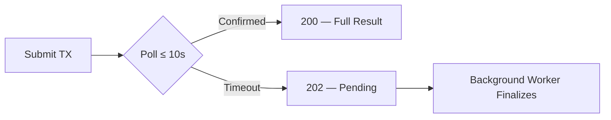
```mermaid
flowchart LR
    SUBMIT[Submit TX] --> POLL{Poll ≤ 10s}
    POLL -->|Confirmed| OK[200 — Full Result]
    POLL -->|Timeout| ACCEPT[202 — Pending]
    ACCEPT --> BG[Background Worker Finalizes]
```

### Decision 3: Server-Side Signing via Vault

| Aspect | Detail |
|--------|--------|
| **Decision** | Private keys are stored in HashiCorp Vault (or cloud KMS). The service signs transactions server-side |
| **Rationale** | Centralizes key management; avoids key exposure in client applications; supports HSM-backed keys for production |
| **Tradeoff** | Introduces Vault as a critical dependency; increases latency for each sign operation (~5-15ms); requires trust in the service operator |
| **Alternative Considered** | Client-side signing where the service only relays pre-signed transactions. Decided to support *both* modes: managed accounts (server-signs) and relay mode (client-signs, service submits) |

### Decision 4: PostgreSQL for Transaction Logging

| Aspect | Detail |
|--------|--------|
| **Decision** | Use PostgreSQL (not a NoSQL store) for transaction records, contracts, and accounts |
| **Rationale** | Strong consistency guarantees for idempotency checks; rich query support for filtering transactions; JSONB for flexible ABI/payload storage; battle-tested in production |
| **Tradeoff** | Schema rigidity requires migrations; horizontal scaling is harder than with DynamoDB/Cassandra |
| **Mitigation** | Partition `transactions` table by `created_at` for time-range queries; read replicas for GET-heavy endpoints |

### Decision 5: Idempotency Keys for Mutation Endpoints

| Aspect | Detail |
|--------|--------|
| **Decision** | All state-changing endpoints accept an `idempotency_key` header/field. Duplicate keys return the original response |
| **Rationale** | Blockchain transactions are irreversible. Network retries or client bugs must not double-submit |
| **Tradeoff** | Adds storage overhead (unique index on idempotency key); requires TTL-based cleanup for old keys |
| **Implementation** | Keys stored with a 72-hour TTL. After expiry, the same key can be reused |

### Decision 6: Rate Limiting Strategy

| Aspect | Detail |
|--------|--------|
| **Decision** | Token-bucket rate limiting per API key, backed by Redis |
| **Rationale** | Protects the service and downstream Aptos nodes from abuse; fair resource allocation across tenants |
| **Tradeoff** | Adds Redis as a runtime dependency; distributed rate limiting has slight inaccuracy under race conditions |
| **Defaults** | 100 requests/minute for read endpoints; 20 requests/minute for execute/submit endpoints |

### Decision 7: Versioned API with `/v1` Prefix

| Aspect | Detail |
|--------|--------|
| **Decision** | URL-based versioning (`/api/v1/...`) rather than header-based versioning |
| **Rationale** | Explicit, easy to route at the load-balancer level, simple to document and test |
| **Tradeoff** | URL pollution; harder to share common paths across versions |
| **Mitigation** | Internal handler code is version-agnostic; only the router layer maps versions to handlers |

### Decision 8: Webhook-Based Event Delivery

| Aspect | Detail |
|--------|--------|
| **Decision** | Events are delivered via outbound webhooks (push model) rather than requiring clients to poll |
| **Rationale** | Real-time delivery; reduces client complexity; aligns with modern event-driven architectures |
| **Tradeoff** | Requires reliable outbound HTTP; must handle receiver downtime with retries; HMAC signing for security adds complexity |
| **Mitigation** | Exponential backoff retries (3 attempts); delivery status dashboard; dead-letter logging after max retries |

### Decision Summary Matrix

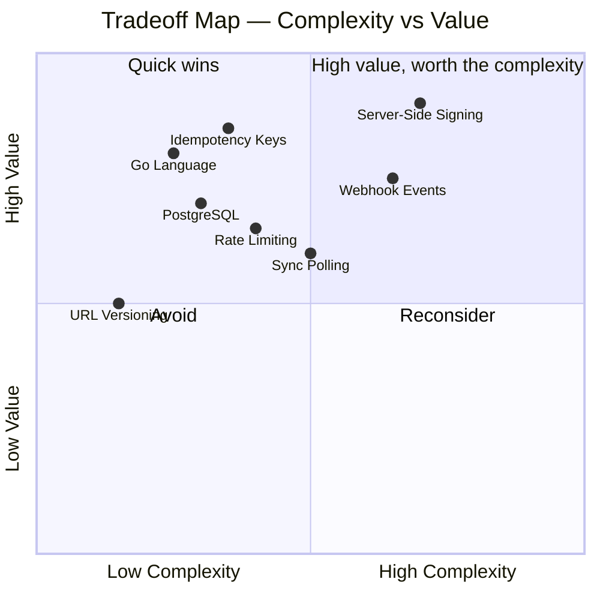
```mermaid
quadrantChart
    title Tradeoff Map — Complexity vs Value
    x-axis Low Complexity --> High Complexity
    y-axis Low Value --> High Value
    quadrant-1 High value, worth the complexity
    quadrant-2 Quick wins
    quadrant-3 Avoid
    quadrant-4 Reconsider

    Idempotency Keys: [0.35, 0.85]
    Server-Side Signing: [0.7, 0.9]
    Webhook Events: [0.65, 0.75]
    PostgreSQL: [0.3, 0.7]
    Rate Limiting: [0.4, 0.65]
    URL Versioning: [0.15, 0.5]
    Sync Polling: [0.5, 0.6]
    Go Language: [0.25, 0.8]
```

---

## 13. Future Expansions

### 13.1 Roadmap Overview

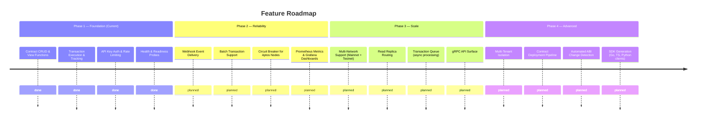
```mermaid
timeline
    title Feature Roadmap
    section Phase 1 — Foundation (Current)
        Contract CRUD & View Functions : done
        Transaction Execution & Tracking : done
        API Key Auth & Rate Limiting : done
        Health & Readiness Probes : done
    section Phase 2 — Reliability
        Webhook Event Delivery : planned
        Batch Transaction Support : planned
        Circuit Breaker for Aptos Nodes : planned
        Prometheus Metrics & Grafana Dashboards : planned
    section Phase 3 — Scale
        Multi-Network Support (Mainnet + Testnet) : planned
        Read Replica Routing : planned
        Transaction Queue (async processing) : planned
        gRPC API Surface : planned
    section Phase 4 — Advanced
        Multi-Tenant Isolation : planned
        Contract Deployment Pipeline : planned
        Automated ABI Change Detection : planned
        SDK Generation (Go, TS, Python clients) : planned
```

### 13.2 Detailed Expansion Plans

#### Multi-Network Support
- Support simultaneous connections to Mainnet, Testnet, and Devnet
- Network selection per request via header or contract-level default
- Independent rate limits and connection pools per network

#### gRPC API Surface
- Add a gRPC interface alongside REST for internal service-to-service communication
- Proto definitions generated from the same domain models
- Bidirectional streaming for real-time transaction status updates

#### Transaction Queue / Async Processing
- Replace synchronous polling with a message queue (NATS / RabbitMQ)
- Workers consume from the queue, submit to chain, and update status
- Enables higher throughput and better backpressure handling

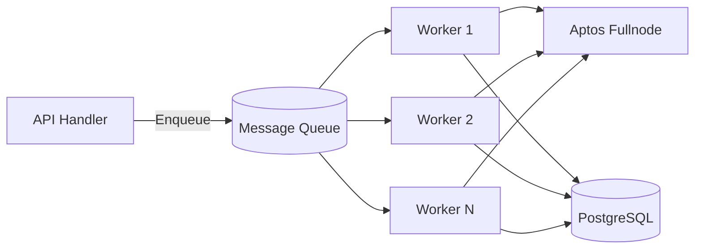
```mermaid
graph LR
    API[API Handler] -->|Enqueue| Q[(Message Queue)]
    Q --> W1[Worker 1]
    Q --> W2[Worker 2]
    Q --> W3[Worker N]
    W1 --> APTOS[Aptos Fullnode]
    W2 --> APTOS
    W3 --> APTOS
    W1 --> DB[(PostgreSQL)]
    W2 --> DB
    W3 --> DB
```

#### Contract Deployment Pipeline
- Upload Move source code via API
- Compile, test, and deploy through a managed pipeline
- Version tracking and rollback support

#### Automated ABI Change Detection
- Periodic polling of registered contract ABIs
- Diff detection with alerting when a module's ABI changes on-chain
- Breaking change notifications to webhook subscribers

#### SDK Generation
- OpenAPI 3.1 spec auto-generated from handler annotations
- Client SDKs generated for Go, TypeScript, and Python
- Published to package registries with version alignment

#### Multi-Tenant Isolation
- Organization-level namespacing for contracts and accounts
- Resource quotas per tenant
- Billing integration for metered usage

---

## 14. Future Testing & Integration Plans

### 14.1 Testing Pyramid

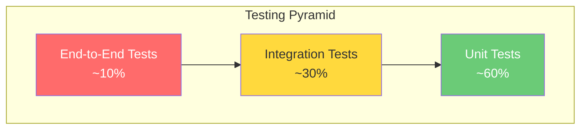
```mermaid
graph TB
    subgraph Testing Pyramid
        E2E[End-to-End Tests<br/>~10%]
        INT[Integration Tests<br/>~30%]
        UNIT[Unit Tests<br/>~60%]
    end

    E2E --> INT --> UNIT

    style E2E fill:#ff6b6b,color:#fff
    style INT fill:#ffd93d,color:#333
    style UNIT fill:#6bcb77,color:#fff
```

### 14.2 Unit Testing Plan

| Component | Strategy | Tools |
|-----------|----------|-------|
| **Handlers** | Test input validation, response mapping, error paths | `net/http/httptest`, `testify` |
| **Services** | Mock repository + chain adapter; test business logic in isolation | `testify/mock`, `gomock` |
| **Repository** | Test query building and mapping; mock DB connection | `sqlmock`, `testify` |
| **Chain Adapter** | Mock Aptos HTTP responses; test BCS encoding, retries | `httptest`, `testify` |
| **Middleware** | Test each middleware in isolation (rate limiter, auth, CORS) | `httptest` |
| **Models** | Validation rules, JSON marshaling/unmarshaling | `testify/assert` |

**Target:** ≥ 80% code coverage across all packages.

### 14.3 Integration Testing Plan

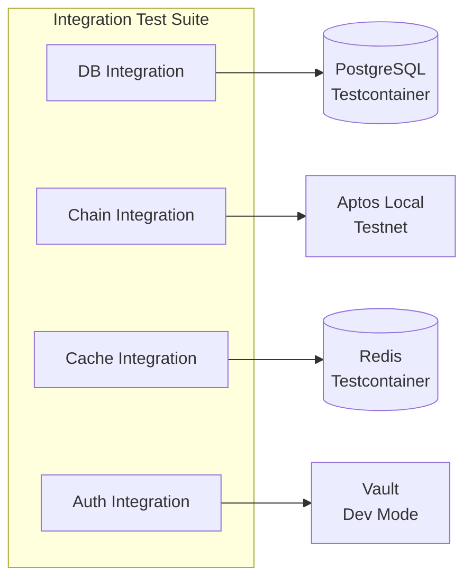
```mermaid
graph LR
    subgraph Integration Test Suite
        IT1[DB Integration]
        IT2[Chain Integration]
        IT3[Cache Integration]
        IT4[Auth Integration]
    end

    IT1 --> PG_TEST[(PostgreSQL<br/>Testcontainer)]
    IT2 --> APTOS_LOCAL[Aptos Local<br/>Testnet]
    IT3 --> REDIS_TEST[(Redis<br/>Testcontainer)]
    IT4 --> VAULT_DEV[Vault<br/>Dev Mode]
```

| Test Category | Scope | Infrastructure |
|--------------|-------|----------------|
| **Database Integration** | Full CRUD lifecycle, migrations, constraints, concurrent access | PostgreSQL via [testcontainers-go](https://github.com/testcontainers/testcontainers-go) |
| **Chain Integration** | Contract call, execute, simulate against a real node | Aptos local testnet (`aptos node run-local-testnet`) |
| **Cache Integration** | Rate limit counting, cache invalidation, TTL behavior | Redis via testcontainers |
| **Auth Integration** | Full API key lifecycle: create → authenticate → scope check → expire | In-memory or testcontainer DB |
| **Webhook Integration** | Event detection → webhook dispatch → retry on failure | Mock HTTP server + testcontainer PostgreSQL |

### 14.4 End-to-End Testing Plan

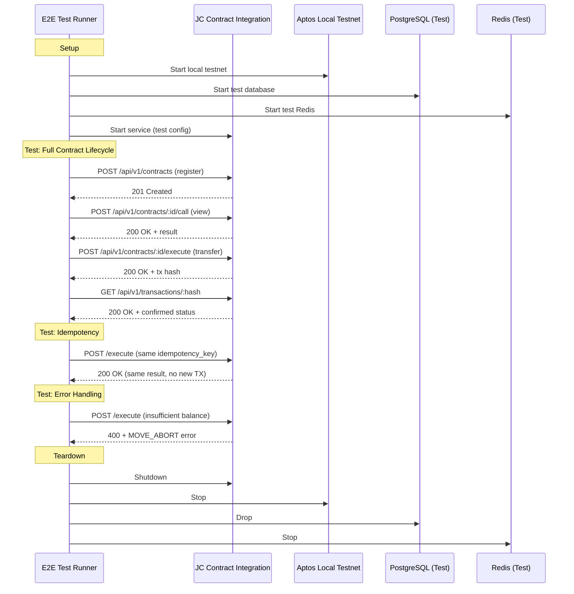
```mermaid
sequenceDiagram
    participant T as E2E Test Runner
    participant API as JC Contract Integration
    participant LT as Aptos Local Testnet
    participant DB as PostgreSQL (Test)
    participant RD as Redis (Test)

    Note over T: Setup
    T->>LT: Start local testnet
    T->>DB: Start test database
    T->>RD: Start test Redis
    T->>API: Start service (test config)

    Note over T: Test: Full Contract Lifecycle
    T->>API: POST /api/v1/contracts (register)
    API-->>T: 201 Created
    T->>API: POST /api/v1/contracts/:id/call (view)
    API-->>T: 200 OK + result
    T->>API: POST /api/v1/contracts/:id/execute (transfer)
    API-->>T: 200 OK + tx hash
    T->>API: GET /api/v1/transactions/:hash
    API-->>T: 200 OK + confirmed status

    Note over T: Test: Idempotency
    T->>API: POST /execute (same idempotency_key)
    API-->>T: 200 OK (same result, no new TX)

    Note over T: Test: Error Handling
    T->>API: POST /execute (insufficient balance)
    API-->>T: 400 + MOVE_ABORT error

    Note over T: Teardown
    T->>API: Shutdown
    T->>LT: Stop
    T->>DB: Drop
    T->>RD: Stop
```

### 14.5 CI/CD Pipeline


```mermaid
graph LR
    subgraph CI Pipeline
        LINT[golangci-lint] --> UNIT[Unit Tests]
        UNIT --> BUILD[Build Binary]
        BUILD --> INT[Integration Tests<br/>testcontainers]
        INT --> E2E[E2E Tests<br/>local testnet]
        E2E --> SEC[Security Scan<br/>govulncheck + trivy]
        SEC --> IMG[Build Docker Image]
        IMG --> PUSH[Push to Registry]
    end

    subgraph CD Pipeline
        PUSH --> DEV[Deploy to Dev]
        DEV --> SMOKE[Smoke Tests]
        SMOKE --> STG[Deploy to Staging]
        STG --> PERF[Performance Tests]
        PERF --> PROD[Deploy to Production]
        PROD --> MON[Post-Deploy Monitoring]
    end
```

### 14.6 Performance & Load Testing

| Test Type | Tool | Target |
|-----------|------|--------|
| **Load Testing** | k6 / Vegeta | Sustain 1,000 RPS on read endpoints; 100 RPS on execute |
| **Soak Testing** | k6 (extended) | 24-hour run at 50% capacity; monitor for memory leaks |
| **Spike Testing** | k6 | 10x traffic burst for 60s; verify graceful degradation |
| **Latency Profiling** | pprof + Jaeger | P99 < 200ms for reads; P99 < 2s for execute (excl. chain time) |

### 14.7 Contract Testing (Consumer-Driven)

```mermaid
graph TD
    subgraph Provider: JC Contract Integration
        PACT_V[Pact Verifier]
        API_SVC[API Service]
    end

    subgraph Consumer: Web App
        PACT_C1[Pact Consumer Test]
    end

    subgraph Consumer: Mobile App
        PACT_C2[Pact Consumer Test]
    end

    subgraph Pact Broker
        BROKER[(Pact Broker)]
    end

    PACT_C1 -->|Publish pact| BROKER
    PACT_C2 -->|Publish pact| BROKER
    BROKER -->|Fetch pacts| PACT_V
    PACT_V -->|Verify against| API_SVC
```

- Consumer teams publish Pact contracts defining expected request/response pairs
- Provider CI verifies all consumer pacts before deployment
- Breaking changes are caught before they reach production

### 14.8 Security Testing

| Area | Approach |
|------|----------|
| **Dependency Scanning** | `govulncheck` on every CI run; Dependabot for automated PRs |
| **SAST** | `gosec` for Go-specific security issues |
| **Container Scanning** | Trivy on Docker images |
| **API Fuzzing** | RESTler or custom fuzzer against OpenAPI spec |
| **Penetration Testing** | Annual third-party pen test on staging environment |
| **Secret Detection** | `gitleaks` pre-commit hook + CI check |

---

## 15. Appendix

### A. Environment Variables

| Variable | Required | Default | Description |
|----------|----------|---------|-------------|
| `PORT` | No | `8080` | HTTP listen port |
| `ENV` | No | `development` | Environment name |
| `DATABASE_URL` | Yes | — | PostgreSQL connection string |
| `REDIS_URL` | Yes | — | Redis connection string |
| `APTOS_NODE_URL` | Yes | — | Fullnode REST API URL |
| `APTOS_INDEXER_URL` | No | — | Indexer GraphQL URL |
| `APTOS_NETWORK` | No | `testnet` | Network name |
| `VAULT_ADDR` | Yes (prod) | — | HashiCorp Vault address |
| `VAULT_TOKEN` | Yes (prod) | — | Vault authentication token |
| `LOG_LEVEL` | No | `info` | Logging level |
| `RATE_LIMIT_READ` | No | `100` | Reads per minute per key |
| `RATE_LIMIT_WRITE` | No | `20` | Writes per minute per key |
| `TX_POLL_TIMEOUT` | No | `10s` | Max time to poll for TX confirmation |
| `TX_POLL_INTERVAL` | No | `500ms` | Polling interval for TX status |

### B. HTTP Status Code Usage

| Status | When Used |
|--------|-----------|
| `200 OK` | Successful read, view function call, or confirmed transaction |
| `201 Created` | Resource created (contract registered, account created) |
| `202 Accepted` | Transaction submitted but not yet confirmed |
| `204 No Content` | Successful deletion |
| `400 Bad Request` | Validation error in request body/params |
| `401 Unauthorized` | Missing or invalid API key |
| `403 Forbidden` | Valid API key but insufficient scope |
| `404 Not Found` | Resource does not exist |
| `409 Conflict` | Duplicate resource (e.g., contract already registered) |
| `422 Unprocessable Entity` | Semantically invalid (e.g., invalid Move address format) |
| `429 Too Many Requests` | Rate limit exceeded |
| `500 Internal Server Error` | Unexpected server failure |
| `502 Bad Gateway` | Aptos node returned an error |
| `503 Service Unavailable` | Service is starting up or Aptos node is unreachable |

### C. Glossary

| Term | Definition |
|------|------------|
| **Move** | The smart contract language used by the Aptos blockchain |
| **BCS** | Binary Canonical Serialization — Aptos transaction encoding format |
| **Fullnode** | An Aptos node that serves the REST API and stores the full blockchain state |
| **Indexer** | Aptos service that provides aggregated/enriched blockchain data via GraphQL |
| **Sequence Number** | Per-account transaction counter used to prevent replay attacks |
| **View Function** | A read-only Move function that does not modify state |
| **Entry Function** | A Move function that can be called via a transaction to modify state |
| **ABI** | Application Binary Interface — describes the functions and types of a Move module |
| **Gas** | Computational cost unit for executing transactions on Aptos |
| **HSM** | Hardware Security Module — physical device for secure key storage |

---

*Document generated for `aptos-labs/jc-contract-integration` — Last updated 2026-02-27*
